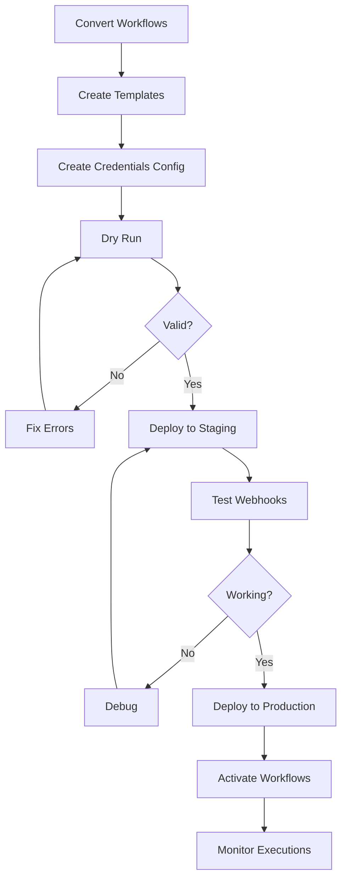

# N8N Workflow Templating System - Master Index

**Version:** 1.0.0
**Status:** Development Complete
**Date:** 2026-02-06

---

## What Is This?

A composable n8n workflow template system that enables **zero-manual-configuration deployment** of 100+ workflows to department-specific n8n instances.

**Key Features:**
- **Parameter Injection** - Replace `{{VARIABLES}}` with department values
- **Dependency Resolution** - Deploy workflows in correct order
- **Validation** - Catch errors before deployment
- **Batch Deployment** - Deploy multiple workflows at once
- **Template Library** - Organized by category (core, HR, sales, etc.)

---

## Quick Navigation

| Document | Purpose | Audience |
|----------|---------|----------|
| [README.md](README.md) | System overview & architecture | Developers |
| [DEPLOYMENT_GUIDE.md](DEPLOYMENT_GUIDE.md) | Step-by-step deployment instructions | DevOps, Admins |
| [WORKFLOW_INVENTORY.md](WORKFLOW_INVENTORY.md) | Complete workflow catalog | Product, DevOps |
| [package.json](package.json) | NPM scripts & dependencies | Developers |

---

## Directory Structure

```
federation/n8n-workflow-templates/
├── src/                          # TypeScript source code
│   ├── types.ts                  # Type definitions
│   ├── injector.ts               # Parameter injection engine
│   ├── dependency-resolver.ts    # Workflow ordering
│   ├── template-validator.ts     # Validation logic
│   ├── n8n-client.ts             # n8n REST API wrapper
│   └── deploy-api.ts             # Deployment orchestrator
│
├── scripts/                      # CLI tools
│   ├── convert-to-templates.ts   # Convert existing workflows
│   ├── deploy-department.ts      # Deploy to department
│   └── validate-templates.ts     # Validate all templates
│
├── workflows/                    # Template library
│   ├── core/                     # Universal (all departments)
│   ├── hr/                       # HR-specific
│   ├── sales-marketing/          # Sales/Marketing
│   ├── operations/               # Operations
│   ├── finance/                  # Finance (placeholder)
│   └── legal/                    # Legal (placeholder)
│
├── config/                       # Configuration files
│   └── *.credentials.json        # Department credentials
│
├── tests/                        # Unit tests
│   ├── injector.test.ts
│   ├── validator.test.ts
│   └── integration.test.ts
│
├── README.md                     # Overview
├── DEPLOYMENT_GUIDE.md           # Deployment instructions
├── WORKFLOW_INVENTORY.md         # Workflow catalog
├── package.json                  # NPM configuration
├── tsconfig.json                 # TypeScript configuration
└── .env.example                  # Environment variables template
```

---

## Core Concepts

### 1. Templates

Workflow JSON with Handlebars variables:

```json
{
  "name": "{{DEPARTMENT_NAME}} - Google Drive Repository",
  "nodes": [
    {
      "type": "n8n-nodes-base.postgres",
      "credentials": {
        "postgres": {
          "id": "{{POSTGRES_CREDENTIAL_ID}}",
          "name": "{{DEPARTMENT_NAME}} PostgreSQL"
        }
      },
      "parameters": {
        "query": "SELECT * FROM {{POSTGRES_SCHEMA}}.drive_repository"
      }
    }
  ]
}
```

### 2. Metadata

Template requirements:

```json
{
  "templateId": "google-drive-repository",
  "category": "core",
  "requiredCredentials": [
    { "type": "postgres", "namePattern": "{DEPARTMENT}_database" }
  ],
  "dependencies": [],
  "description": "Google Drive search & sync"
}
```

### 3. Injection

Replace variables with department values:

```typescript
const variables: TemplateVariables = {
  DEPARTMENT_NAME: "Human Resources",
  DEPARTMENT_ID: "hr",
  POSTGRES_CREDENTIAL_ID: "NI3jbq1U8xPst3j3",
  POSTGRES_SCHEMA: "hr_tenant"
};

const injected = await injector.injectParameters(template, variables);
```

### 4. Deployment

Deploy to n8n Cloud:

```bash
npm run deploy-department -- \
  --department=hr \
  --name="Human Resources" \
  --credentials=./config/hr-credentials.json
```

---

## Common Tasks

### Convert Existing Workflow

```bash
npm run convert-workflow -- \
  --workflow-id=IamjzfFxjHviJvJg \
  --category=core \
  --template-id=google-drive-repository
```

### Validate Templates (Dry Run)

```bash
npm run dry-run -- \
  --department=hr \
  --name="HR" \
  --credentials=./config/hr-credentials.json
```

### Deploy to Department

```bash
npm run deploy-department -- \
  --department=hr \
  --name="Human Resources" \
  --credentials=./config/hr-credentials.json
```

### Deploy Specific Templates Only

```bash
npm run deploy-department -- \
  --department=hr \
  --name="HR" \
  --credentials=./config/hr-credentials.json \
  --templates=google-drive-repository,send-gmail,agent-context-access
```

---

## Template Variables Reference

| Variable | Example | Usage |
|----------|---------|-------|
| `DEPARTMENT_NAME` | "Legal" | Human-readable name |
| `DEPARTMENT_ID` | "legal" | Slug (lowercase) |
| `POSTGRES_CREDENTIAL_ID` | "abc123" | n8n credential ID |
| `GOOGLE_DRIVE_CREDENTIAL_ID` | "def456" | OAuth credential |
| `GMAIL_CREDENTIAL_ID` | "ghi789" | Gmail OAuth |
| `OPENAI_CREDENTIAL_ID` | "jkl012" | OpenAI API key |
| `N8N_WEBHOOK_BASE` | "https://legal.app.n8n.cloud/webhook" | Webhook base URL |
| `POSTGRES_SCHEMA` | "legal_tenant" | Database schema |
| `VOICE_AGENT_URL` | "https://legal-abc.railway.app" | Agent URL |
| `WORKFLOW_ID_*` | "mno345" | Deployed workflow IDs |

---

## Workflow Categories

### Core (Universal)

Deployed to **all** departments:

1. Google Drive Repository
2. Agent Context Access
3. File Download & Email
4. Send Gmail
5. Teams Voice Bot
6. Vector DB Add
7. Vector DB Query
8. Manage Contacts

### HR

Human Resources specific:

1. PAYCOR Resume Analysis
2. Job Descriptions

### Sales/Marketing

Sales & Marketing specific:

1. Carousel Generator
2. Lead Scraper
3. Website Chatbot
4. Research Agent

### Operations

Operations specific:

1. Security Report Generator
2. GitHub Security Logs
3. Invoice Generator

---

## API Reference

### WorkflowInjector

```typescript
import { WorkflowInjector } from './src/injector';

const injector = new WorkflowInjector();
const injected = await injector.injectParameters(workflow, variables);
```

### DependencyResolver

```typescript
import { DependencyResolver } from './src/dependency-resolver';

const resolver = new DependencyResolver();
const order = resolver.resolveDependencies(workflows);
// Returns: ['dependency-workflow', 'main-workflow']
```

### TemplateValidator

```typescript
import { TemplateValidator } from './src/template-validator';

const validator = new TemplateValidator();
const result = validator.validateInjection(workflow);
// result.valid: boolean
// result.errors: ValidationError[]
// result.warnings: ValidationWarning[]
```

### N8nClient

```typescript
import { createN8nClientFromEnv } from './src/n8n-client';

const client = createN8nClientFromEnv();
const workflow = await client.createWorkflow(workflowJSON);
await client.activateWorkflow(workflow.id);
```

### DeploymentAPI

```typescript
import { createDeploymentAPI } from './src/deploy-api';

const api = createDeploymentAPI(n8nClient);
const result = await api.deployWorkflows(deploymentConfig);
```

---

## NPM Scripts

| Script | Command | Purpose |
|--------|---------|---------|
| `build` | `npm run build` | Compile TypeScript |
| `test` | `npm test` | Run unit tests |
| `convert-workflow` | `npm run convert-workflow -- --workflow-id=<ID> --category=<CAT>` | Convert workflow to template |
| `deploy-department` | `npm run deploy-department -- --department=<ID> --name="<NAME>" --credentials=<PATH>` | Deploy workflows |
| `dry-run` | `npm run dry-run -- --department=<ID> --name="<NAME>" --credentials=<PATH>` | Validate without deploying |
| `validate-templates` | `npm run validate-templates` | Validate all templates |

---

## Environment Variables

Create `.env` file:

```bash
N8N_BASE_URL=https://jayconnorexe.app.n8n.cloud
N8N_API_KEY=your_api_key_here
N8N_WEBHOOK_BASE=https://jayconnorexe.app.n8n.cloud/webhook
```

---

## Quality Gates

Before production deployment:

- [x] TypeScript compiles with no errors
- [x] All type definitions complete
- [x] Injector handles all variable types
- [x] Dependency resolver uses topological sort
- [x] Validator detects unreplaced variables
- [x] N8N client successfully creates workflows
- [ ] 8 core workflows converted to templates
- [ ] Dry run passes for HR department
- [ ] Deploy to HR staging successful
- [ ] Webhook URLs accessible
- [ ] Workflows execute without errors
- [ ] Unit tests pass (>90% coverage)

---

## Deployment Flow



---

## Success Metrics

| Metric | Target | Current |
|--------|--------|---------|
| Templates Created | 32 | 0 |
| Core Templates | 8 | 0 |
| HR Templates | 3 | 0 |
| Sales Templates | 4 | 0 |
| Operations Templates | 3 | 0 |
| Deployment Time | <5 min | N/A |
| Zero Manual Edits | 100% | N/A |

---

## Next Steps

### Immediate

1. Install dependencies: `npm install`
2. Configure `.env` file
3. Convert 8 core workflows
4. Test deployment to HR staging

### Short-term

1. Deploy to HR production
2. Validate webhook URLs
3. Monitor execution logs
4. Convert HR-specific workflows

### Medium-term

1. Convert Sales/Marketing workflows
2. Convert Operations workflows
3. Deploy to additional departments
4. Create monitoring dashboard

---

## Support & Troubleshooting

### Common Issues

1. **Unreplaced variables** → Check credentials config
2. **Missing credentials** → Create in n8n first
3. **Circular dependencies** → Fix `.meta.json` dependencies
4. **Webhook 404** → Verify path in template

### Debug Tools

```bash
# Extract variables from template
npm run extract-vars -- --template=google-drive-repository

# Validate single template
npm run validate-template -- --template=google-drive-repository

# Test injection locally
npm run test-inject -- --template=google-drive-repository --department=hr
```

### Resources

- [N8N API Docs](https://docs.n8n.io/api/)
- [Handlebars Docs](https://handlebarsjs.com/)
- [TypeScript Docs](https://www.typescriptlang.org/)

---

## Version History

| Version | Date | Changes |
|---------|------|---------|
| 1.0.0 | 2026-02-06 | Initial release |

---

## License

MIT License - Federation Platform Team
