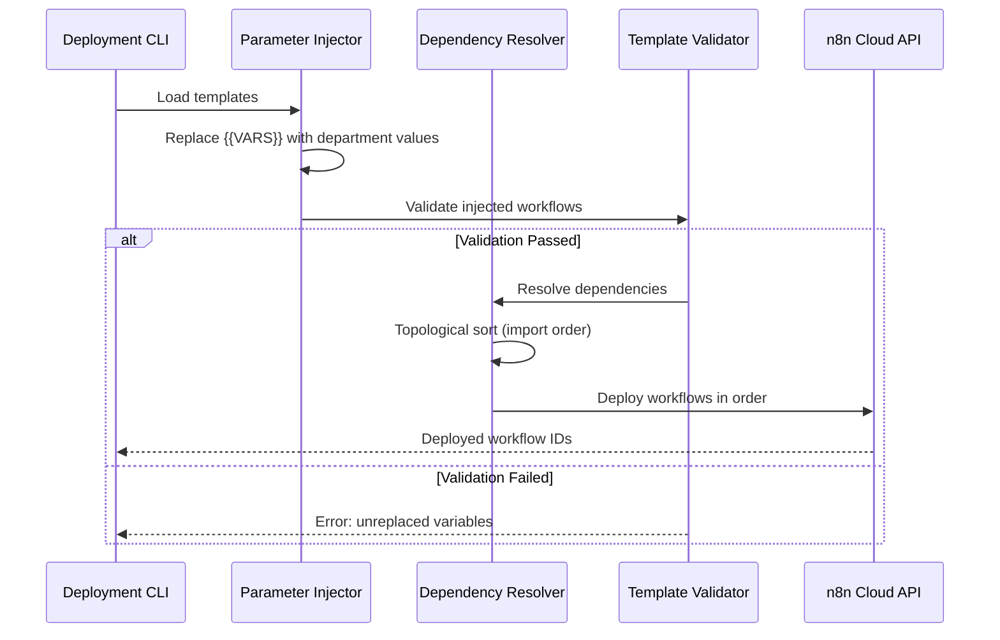

# N8N Workflow Templating System

**Version:** 1.0.0
**Purpose:** Composable template system for deploying 104+ workflows to department-specific n8n instances with zero manual editing.

---

## Architecture Overview

```
n8n-workflow-templates/
├── workflows/                   # Template library organized by category
│   ├── core/                    # Universal workflows (all departments)
│   ├── hr/                      # HR-specific workflows
│   ├── sales-marketing/         # Sales/Marketing workflows
│   ├── operations/              # Operations workflows
│   ├── finance/                 # Finance workflows (placeholder)
│   └── legal/                   # Legal workflows (placeholder)
│
├── src/
│   ├── injector.ts              # Parameter injection engine
│   ├── dependency-resolver.ts   # Workflow import order resolver
│   ├── deploy-api.ts            # n8n REST API deployment
│   ├── n8n-client.ts            # n8n API wrapper
│   ├── template-validator.ts    # Validation logic
│   └── types.ts                 # TypeScript interfaces
│
├── scripts/
│   ├── convert-to-templates.ts  # Convert existing workflows
│   ├── deploy-department.ts     # CLI deployment tool
│   └── validate-templates.ts    # Template validation script
│
├── tests/
│   ├── injector.test.ts         # Unit tests for injection
│   ├── validator.test.ts        # Validation tests
│   └── integration.test.ts      # End-to-end deployment tests
│
├── package.json
├── tsconfig.json
└── README.md
```

---

## Quick Start

### 1. Install Dependencies

```bash
cd /Users/jelalconnor/CODING/N8N/Workflows/federation/n8n-workflow-templates
npm install
```

### 2. Deploy Workflows to Department

```bash
npm run deploy-department -- \
  --department hr \
  --name "Human Resources" \
  --credentials ./config/hr-credentials.json
```

### 3. Validate Templates

```bash
npm run validate-templates
```

---

## Template Format

Each workflow template has:
- **Workflow JSON** (`.json`) - n8n workflow with Handlebars variables
- **Metadata** (`.meta.json`) - Required credentials, webhooks, dependencies

### Template Variables

| Variable | Example | Usage |
|----------|---------|-------|
| `{{DEPARTMENT_NAME}}` | "Legal" | Human-readable name |
| `{{DEPARTMENT_ID}}` | "legal" | Slug for URLs/schemas |
| `{{POSTGRES_CREDENTIAL_ID}}` | "abc123" | n8n credential ID |
| `{{GOOGLE_DRIVE_CREDENTIAL_ID}}` | "def456" | OAuth credential ID |
| `{{N8N_WEBHOOK_BASE}}` | "https://legal.app.n8n.cloud/webhook" | Webhook base URL |
| `{{POSTGRES_SCHEMA}}` | "legal_tenant" | Database schema |
| `{{VOICE_AGENT_URL}}` | "https://legal-abc.railway.app" | Agent URL |

### Example Template

```json
{
  "name": "{{DEPARTMENT_NAME}} - Google Drive Repository",
  "nodes": [
    {
      "parameters": {
        "path": "/{{DEPARTMENT_ID}}/drive-repository"
      },
      "type": "n8n-nodes-base.webhook"
    },
    {
      "parameters": {
        "query": "SELECT * FROM {{POSTGRES_SCHEMA}}.drive_document_repository"
      },
      "type": "n8n-nodes-base.postgres",
      "credentials": {
        "postgres": {
          "id": "{{POSTGRES_CREDENTIAL_ID}}",
          "name": "{{DEPARTMENT_NAME}} PostgreSQL"
        }
      }
    }
  ]
}
```

### Metadata File

```json
{
  "templateId": "google-drive-repository",
  "name": "Google Drive Document Repository",
  "category": "core",
  "requiredCredentials": [
    {
      "type": "googleDriveOAuth2Api",
      "namePattern": "{DEPARTMENT}_drive_oauth"
    },
    {
      "type": "postgres",
      "namePattern": "{DEPARTMENT}_database"
    }
  ],
  "requiredWebhooks": [
    {
      "path": "/drive-repository",
      "method": "POST"
    }
  ],
  "dependencies": [],
  "description": "Search, sync, and retrieve Google Drive documents",
  "estimatedExecutionTime": "2-5 seconds"
}
```

---

## Deployment Flow



---

## Template Categories

### Core Workflows (Universal)

| Template ID | Description | Dependencies |
|-------------|-------------|--------------|
| `google-drive-repository` | Google Drive search & sync | - |
| `agent-context-access` | Query voice agent context | - |
| `file-download-email` | Download files & email | - |
| `teams-voice-bot` | Voice bot launcher | `gmail-subworkflow` |
| `send-gmail` | Gmail sending tool | - |
| `vector-db-add` | Add to vector database | - |
| `vector-db-query` | Query vector database | - |

### HR Workflows

| Template ID | Description | Dependencies |
|-------------|-------------|--------------|
| `paycor-resume-analysis` | Resume screening | - |
| `job-descriptions` | Job description generator | - |

### Sales/Marketing Workflows

| Template ID | Description | Dependencies |
|-------------|-------------|--------------|
| `carousel-generator` | AI carousel creator | - |
| `lead-scraper` | LinkedIn scraper | - |
| `website-chatbot` | Branded chatbot | - |

### Operations Workflows

| Template ID | Description | Dependencies |
|-------------|-------------|--------------|
| `security-report-generator` | Security reports | - |
| `github-security-logs` | GitHub audit logs | - |
| `invoice-generator` | Invoice generation | - |

---

## Credential Mapping

Each department requires these credentials in n8n:

| Credential Type | Purpose | Template Variable |
|----------------|---------|-------------------|
| PostgreSQL | Database access | `{{POSTGRES_CREDENTIAL_ID}}` |
| Google Drive OAuth | Drive access | `{{GOOGLE_DRIVE_CREDENTIAL_ID}}` |
| Gmail OAuth | Email sending | `{{GMAIL_CREDENTIAL_ID}}` |
| OpenAI API | AI generation | `{{OPENAI_CREDENTIAL_ID}}` |

---

## Development

### Convert Existing Workflow to Template

```bash
npm run convert-workflow -- --workflow-id IamjzfFxjHviJvJg --category core
```

### Test Injection Locally

```bash
npm run test-inject -- --template google-drive-repository --department hr
```

### Validate All Templates

```bash
npm run validate-templates
```

---

## API Reference

See TypeScript interfaces in `src/types.ts` for complete API documentation.

---

## Quality Gates

Before deploying templates to production:

- [ ] All 104 workflows templatized (or prioritized 32 active)
- [ ] Parameter injection tested (no unreplaced variables)
- [ ] Deployment API tested with n8n sandbox
- [ ] Dependency resolver handles Execute Workflow dependencies
- [ ] Validation detects errors pre-deployment
- [ ] Template library organized by category
- [ ] TypeScript compiles with no errors
- [ ] Unit tests pass (>90% coverage)

---

## Success Criteria

Template system is production-ready when:

1. Can convert existing workflow to template
2. Can inject department-specific parameters
3. Can deploy workflows to n8n via API
4. Dependency resolution works (correct import order)
5. Tested with 5 core workflows (Drive Repository, Voice Bot, Gmail, Context Access, File Download)

---

## Support

For issues or questions, contact Federation Platform team.
