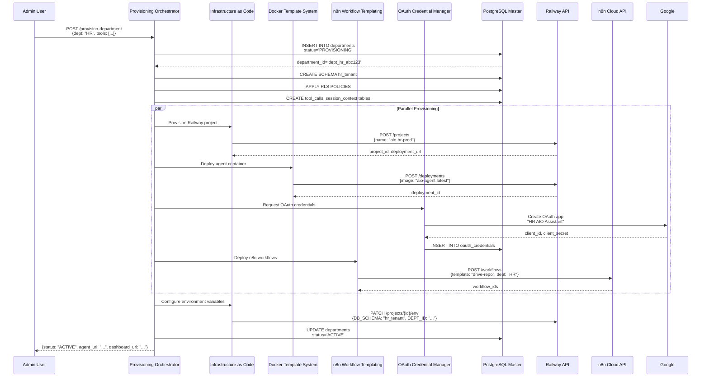
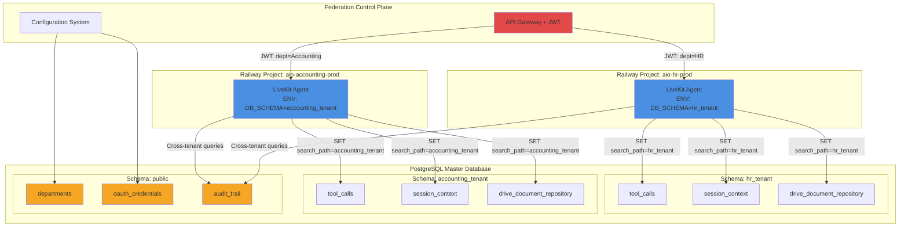
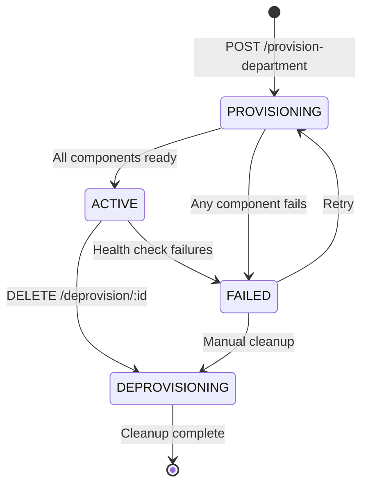
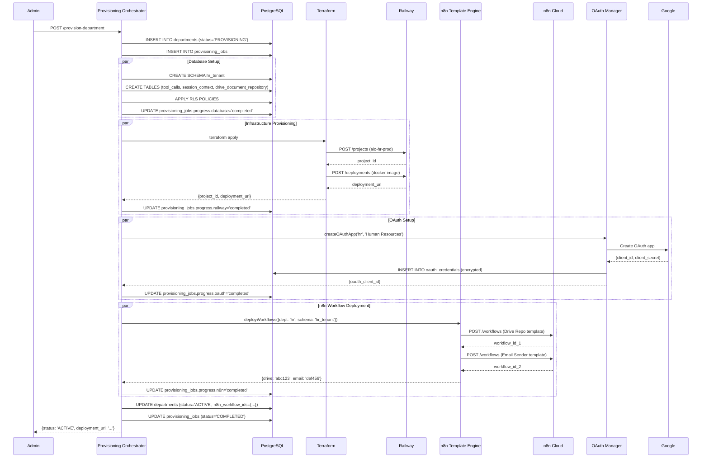
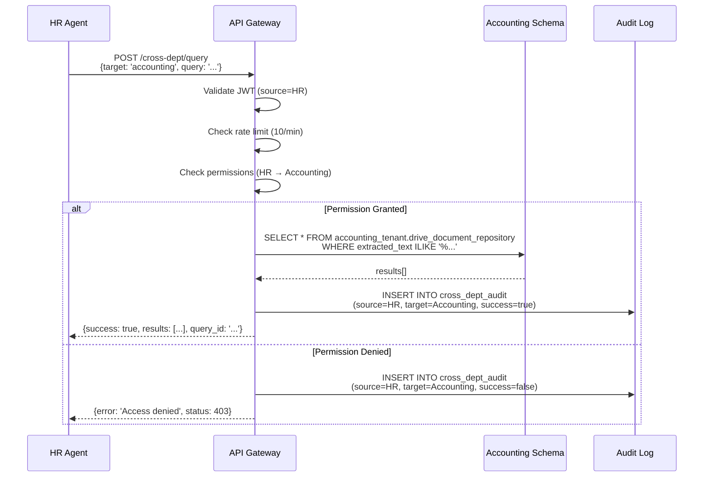
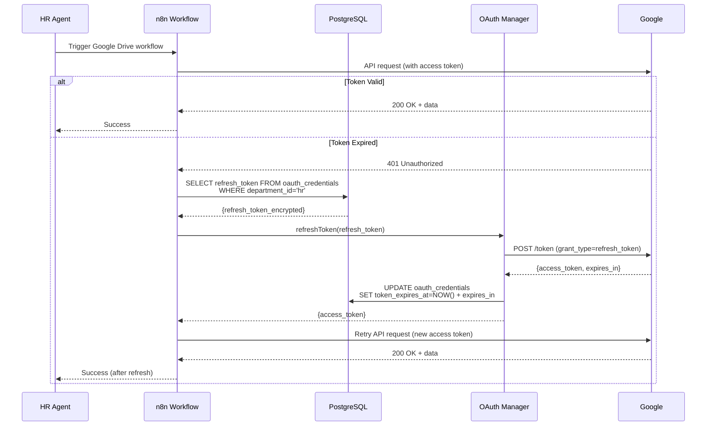

# Federation Platform - Architecture Blueprint

**Version:** 1.0.0
**Date:** 2026-02-06
**Status:** Design Phase

---

## Executive Summary

The Federation Platform is a multi-tenant AIO (All-In-One) voice assistant provisioning system designed to deploy department-specific voice assistant instances in under 5 minutes with zero manual configuration. The platform transforms the current monolithic AIO system into a scalable, multi-tenant architecture supporting 100+ department instances.

**Key Metrics:**
- **Provisioning Time:** <5 minutes per department
- **Target Scale:** 100+ concurrent department instances
- **Isolation Level:** Database-level (PostgreSQL RLS) + Network-level (Railway projects)
- **Estimated Cost per Department:** $150-200/month (Railway + API usage)

---

## Table of Contents

1. [System Architecture Overview](#1-system-architecture-overview)
2. [Component Architecture](#2-component-architecture)
3. [API Contracts](#3-api-contracts)
4. [Data Models](#4-data-models)
5. [Technology Stack](#5-technology-stack)
6. [Integration Patterns](#6-integration-patterns)
7. [Scalability Analysis](#7-scalability-analysis)

---

## 1. System Architecture Overview

### 1.1 High-Level Architecture Diagram

```mermaid
graph TB
    subgraph "Federation Control Plane"
        PO[Provisioning Orchestrator<br/>Node.js + Express]
        CM[Configuration System<br/>JSON Schema + Templates]
        OCM[OAuth Credential Manager<br/>Vault + Rotation]
        AG[API Gateway<br/>Kong + JWT Auth]
    end

    subgraph "Federation Data Plane"
        DB[(PostgreSQL Master<br/>Multi-tenant RLS)]
        DTS[Docker Template System<br/>Pre-built Images]
        IAC[Infrastructure as Code<br/>Terraform + Railway API]
        NWT[n8n Workflow Templating<br/>JSON Templates + MCP]
    end

    subgraph "Department: HR"
        HR_AGENT[LiveKit Agent<br/>Railway Project]
        HR_N8N[n8n Workflows<br/>HR-scoped]
        HR_DB[(PostgreSQL Schema<br/>hr_tenant)]
    end

    subgraph "Department: Accounting"
        ACC_AGENT[LiveKit Agent<br/>Railway Project]
        ACC_N8N[n8n Workflows<br/>Accounting-scoped]
        ACC_DB[(PostgreSQL Schema<br/>accounting_tenant)]
    end

    subgraph "Department: Sales"
        SALES_AGENT[LiveKit Agent<br/>Railway Project]
        SALES_N8N[n8n Workflows<br/>Sales-scoped]
        SALES_DB[(PostgreSQL Schema<br/>sales_tenant)]
    end

    subgraph "External Services"
        LIVEKIT[LiveKit Cloud<br/>WebRTC Rooms]
        CEREBRAS[Cerebras LLM<br/>llama-3.3-70b]
        DEEPGRAM[Deepgram STT<br/>nova-3]
        CARTESIA[Cartesia TTS<br/>sonic-3]
        GOOGLE[Google Workspace<br/>Drive + Gmail OAuth]
    end

    PO --> IAC
    PO --> DTS
    PO --> NWT
    PO --> DB
    PO --> OCM

    IAC --> HR_AGENT
    IAC --> ACC_AGENT
    IAC --> SALES_AGENT

    DTS --> HR_AGENT
    DTS --> ACC_AGENT
    DTS --> SALES_AGENT

    NWT --> HR_N8N
    NWT --> ACC_N8N
    NWT --> SALES_N8N

    DB --> HR_DB
    DB --> ACC_DB
    DB --> SALES_DB

    OCM --> GOOGLE

    AG --> HR_AGENT
    AG --> ACC_AGENT
    AG --> SALES_AGENT

    HR_AGENT --> LIVEKIT
    HR_AGENT --> CEREBRAS
    HR_AGENT --> DEEPGRAM
    HR_AGENT --> CARTESIA
    HR_N8N --> HR_DB
    HR_N8N --> GOOGLE

    ACC_AGENT --> LIVEKIT
    ACC_AGENT --> CEREBRAS
    ACC_AGENT --> DEEPGRAM
    ACC_AGENT --> CARTESIA
    ACC_N8N --> ACC_DB
    ACC_N8N --> GOOGLE

    SALES_AGENT --> LIVEKIT
    SALES_AGENT --> CEREBRAS
    SALES_AGENT --> DEEPGRAM
    SALES_AGENT --> CARTESIA
    SALES_N8N --> SALES_DB
    SALES_N8N --> GOOGLE

    style PO fill:#4A90E2
    style AG fill:#E24A4A
    style OCM fill:#F5A623
    style DB fill:#7ED321
```



### 1.2 Provisioning Flow



### 1.3 Tenant Isolation Model



---

## 2. Component Architecture

### 2.1 Provisioning Orchestrator

**Technology:** Node.js 20 + TypeScript + Express
**Deployment:** Railway (separate from tenant instances)
**Responsibilities:**
- Department provisioning workflow coordination
- State machine management (PROVISIONING → ACTIVE → DEPROVISIONING)
- Parallel resource allocation
- Health check monitoring
- Deprovisioning cleanup

**Key Modules:**

```typescript
// src/orchestrator/provisioning-engine.ts
interface ProvisioningRequest {
  department_name: string;
  department_id: string; // Unique slug: hr, accounting, sales
  enabled_tools: ToolConfig[];
  admin_email: string;
  google_workspace_domain?: string;
  custom_config?: Record<string, any>;
}

interface ProvisioningState {
  department_id: string;
  status: 'PROVISIONING' | 'ACTIVE' | 'DEPROVISIONING' | 'FAILED';
  progress: {
    database: 'pending' | 'in_progress' | 'completed' | 'failed';
    railway: 'pending' | 'in_progress' | 'completed' | 'failed';
    docker: 'pending' | 'in_progress' | 'completed' | 'failed';
    n8n: 'pending' | 'in_progress' | 'completed' | 'failed';
    oauth: 'pending' | 'in_progress' | 'completed' | 'failed';
  };
  created_at: Date;
  completed_at?: Date;
  error_message?: string;
}

class ProvisioningEngine {
  async provisionDepartment(request: ProvisioningRequest): Promise<string> {
    // Returns provisioning_id for status tracking
  }

  async getProvisioningStatus(provisioning_id: string): Promise<ProvisioningState> {}

  async deprovisionDepartment(department_id: string): Promise<void> {}
}
```

**State Machine:**



**Health Check Logic:**

```typescript
interface HealthCheckResult {
  department_id: string;
  status: 'healthy' | 'degraded' | 'down';
  checks: {
    railway_agent: boolean;
    database_connectivity: boolean;
    n8n_workflows: boolean;
    oauth_credentials: boolean;
  };
  last_check: Date;
}

class HealthMonitor {
  async checkDepartmentHealth(department_id: string): Promise<HealthCheckResult> {
    // Parallel health checks with 5s timeout
  }

  async scheduleHealthChecks(): Promise<void> {
    // Cron job: every 5 minutes
  }
}
```

### 2.2 Docker Template System

**Technology:** Docker + Railway Deployment
**Base Image:** `python:3.11-slim`
**Registry:** Private Docker Hub or Railway private registry

**Template Structure:**

```dockerfile
# federation/docker-templates/aio-agent/Dockerfile
FROM python:3.11-slim

# Install system dependencies
RUN apt-get update && apt-get install -y \
    libpq-dev gcc curl && \
    rm -rf /var/lib/apt/lists/*

WORKDIR /app

# Copy pre-built agent code
COPY requirements.txt .
RUN pip install --no-cache-dir -r requirements.txt

COPY src/ ./src/
COPY scripts/ ./scripts/

# Runtime environment variables (injected at deployment)
ENV LIVEKIT_URL=""
ENV LIVEKIT_API_KEY=""
ENV LIVEKIT_API_SECRET=""
ENV DEEPGRAM_API_KEY=""
ENV CEREBRAS_API_KEY=""
ENV CARTESIA_API_KEY=""
ENV DB_HOST=""
ENV DB_PORT="5432"
ENV DB_NAME=""
ENV DB_SCHEMA=""
ENV DB_USER=""
ENV DB_PASSWORD=""
ENV DEPARTMENT_ID=""
ENV N8N_WEBHOOK_BASE_URL=""

# Health check
HEALTHCHECK --interval=30s --timeout=5s --start-period=10s --retries=3 \
  CMD curl -f http://localhost:8080/health || exit 1

EXPOSE 8080

CMD ["python", "-m", "src.agent", "start"]
```

**Pre-loaded Tools:**

```python
# federation/docker-templates/aio-agent/src/tools/
- email_tool.py
- google_drive_tool.py
- database_tool.py
- vector_store_tool.py
- agent_context_tool.py
- file_download_email_tool.py
```

**Configuration at Runtime:**

```typescript
// Provisioning Orchestrator injects environment variables
interface DeploymentConfig {
  department_id: string;
  environment_variables: {
    DB_SCHEMA: string; // e.g., "hr_tenant"
    DEPARTMENT_ID: string; // e.g., "dept_hr_abc123"
    N8N_WEBHOOK_BASE_URL: string; // e.g., "https://jayconnorexe.app.n8n.cloud/webhook"
    ENABLED_TOOLS: string; // JSON array: ["email", "drive", "database"]
    // External API keys (shared across all tenants or per-tenant)
    LIVEKIT_URL: string;
    CEREBRAS_API_KEY: string;
    // Department-specific OAuth credentials
    GOOGLE_OAUTH_CLIENT_ID: string;
    GOOGLE_OAUTH_CLIENT_SECRET: string;
  };
}
```

**Tool Loading Logic:**

```python
# src/tools/tool_loader.py
import os
import json
from typing import List

def load_enabled_tools() -> List[str]:
    enabled = os.getenv('ENABLED_TOOLS', '[]')
    return json.loads(enabled)

def register_tools(llm_instance):
    enabled_tools = load_enabled_tools()

    if 'email' in enabled_tools:
        from .email_tool import email_async
        llm_instance.register_tool(email_async)

    if 'drive' in enabled_tools:
        from .google_drive_tool import google_drive_async
        llm_instance.register_tool(google_drive_async)

    if 'database' in enabled_tools:
        from .database_tool import database_async
        llm_instance.register_tool(database_async)

    # ... other tools
```

### 2.3 Database Schema Generator

**Technology:** PostgreSQL 15+ with Row-Level Security (RLS)
**Architecture:** Shared database, per-tenant schemas

**Schema Isolation Strategy:**

```sql
-- federation/database/templates/tenant_schema.sql

-- Create tenant schema
CREATE SCHEMA IF NOT EXISTS {{TENANT_SCHEMA}};

-- Set default search path for tenant connections
ALTER ROLE {{TENANT_DB_USER}} SET search_path TO {{TENANT_SCHEMA}}, public;

-- Grant schema permissions
GRANT USAGE ON SCHEMA {{TENANT_SCHEMA}} TO {{TENANT_DB_USER}};
GRANT ALL ON ALL TABLES IN SCHEMA {{TENANT_SCHEMA}} TO {{TENANT_DB_USER}};
GRANT ALL ON ALL SEQUENCES IN SCHEMA {{TENANT_SCHEMA}} TO {{TENANT_DB_USER}};

-- Create tenant-specific tables
CREATE TABLE {{TENANT_SCHEMA}}.tool_calls (
    id UUID PRIMARY KEY DEFAULT gen_random_uuid(),
    tool_call_id VARCHAR(100) UNIQUE NOT NULL,
    session_id VARCHAR(100) NOT NULL,
    intent_id VARCHAR(100),
    function_name VARCHAR(100) NOT NULL,
    parameters JSONB NOT NULL DEFAULT '{}',
    status VARCHAR(20) NOT NULL DEFAULT 'EXECUTING',
    result JSONB,
    error_message TEXT,
    voice_response TEXT,
    callback_url TEXT,
    created_at TIMESTAMPTZ DEFAULT NOW(),
    completed_at TIMESTAMPTZ,
    execution_time_ms INTEGER,
    CONSTRAINT valid_status CHECK (
        status IN ('EXECUTING', 'COMPLETED', 'FAILED', 'CANCELLED')
    )
);

CREATE INDEX idx_tool_calls_session ON {{TENANT_SCHEMA}}.tool_calls(session_id);
CREATE INDEX idx_tool_calls_status ON {{TENANT_SCHEMA}}.tool_calls(status);
CREATE INDEX idx_tool_calls_created ON {{TENANT_SCHEMA}}.tool_calls(created_at DESC);

CREATE TABLE {{TENANT_SCHEMA}}.session_context (
    id UUID PRIMARY KEY DEFAULT gen_random_uuid(),
    session_id VARCHAR(100) NOT NULL,
    context_type VARCHAR(50) NOT NULL, -- 'google_drive', 'recent_emails', 'calendar'
    context_key VARCHAR(255) NOT NULL,
    context_value JSONB NOT NULL,
    ttl_seconds INTEGER NOT NULL DEFAULT 3600,
    created_at TIMESTAMPTZ DEFAULT NOW(),
    expires_at TIMESTAMPTZ GENERATED ALWAYS AS (created_at + (ttl_seconds * INTERVAL '1 second')) STORED
);

CREATE INDEX idx_session_context_session ON {{TENANT_SCHEMA}}.session_context(session_id);
CREATE INDEX idx_session_context_type ON {{TENANT_SCHEMA}}.session_context(context_type);
CREATE INDEX idx_session_context_expires ON {{TENANT_SCHEMA}}.session_context(expires_at);

-- Google Drive Document Repository
CREATE TABLE {{TENANT_SCHEMA}}.drive_document_repository (
    id BIGSERIAL PRIMARY KEY,
    drive_file_id VARCHAR(255) UNIQUE NOT NULL,
    drive_folder_id VARCHAR(255) NOT NULL,
    file_name VARCHAR(255),
    mime_type VARCHAR(100),
    file_size_bytes BIGINT,
    web_view_link TEXT,
    drive_modified_time TIMESTAMPTZ,
    extracted_text TEXT,
    text_length INTEGER,
    extraction_method VARCHAR(50),
    extraction_status VARCHAR(50),
    ai_analysis JSONB,
    access_count INTEGER NOT NULL DEFAULT 0,
    first_accessed_at TIMESTAMPTZ NOT NULL DEFAULT NOW(),
    last_accessed_at TIMESTAMPTZ NOT NULL DEFAULT NOW(),
    created_at TIMESTAMPTZ NOT NULL DEFAULT NOW(),
    updated_at TIMESTAMPTZ NOT NULL DEFAULT NOW()
);

CREATE INDEX idx_drive_file_id ON {{TENANT_SCHEMA}}.drive_document_repository(drive_file_id);
CREATE INDEX idx_drive_folder_id ON {{TENANT_SCHEMA}}.drive_document_repository(drive_folder_id);
CREATE INDEX idx_extraction_status ON {{TENANT_SCHEMA}}.drive_document_repository(extraction_status);

-- Audit log (local to tenant)
CREATE TABLE {{TENANT_SCHEMA}}.audit_log (
    id UUID PRIMARY KEY DEFAULT gen_random_uuid(),
    event_type VARCHAR(50) NOT NULL,
    user_id VARCHAR(100),
    session_id VARCHAR(100),
    resource_type VARCHAR(50),
    resource_id VARCHAR(255),
    action VARCHAR(50) NOT NULL,
    details JSONB,
    ip_address INET,
    user_agent TEXT,
    created_at TIMESTAMPTZ DEFAULT NOW()
);

CREATE INDEX idx_audit_log_event ON {{TENANT_SCHEMA}}.audit_log(event_type);
CREATE INDEX idx_audit_log_created ON {{TENANT_SCHEMA}}.audit_log(created_at DESC);
CREATE INDEX idx_audit_log_session ON {{TENANT_SCHEMA}}.audit_log(session_id);
```

**Global Schema (Control Plane):**

```sql
-- federation/database/schemas/global.sql

CREATE SCHEMA IF NOT EXISTS federation;

-- Department registry
CREATE TABLE federation.departments (
    id UUID PRIMARY KEY DEFAULT gen_random_uuid(),
    department_id VARCHAR(100) UNIQUE NOT NULL, -- slug: hr, accounting, sales
    department_name VARCHAR(255) NOT NULL,
    status VARCHAR(20) NOT NULL DEFAULT 'PROVISIONING',
    tenant_schema VARCHAR(63) NOT NULL, -- PostgreSQL schema name
    railway_project_id VARCHAR(255),
    railway_deployment_url TEXT,
    n8n_workflow_ids JSONB, -- {"email": "abc123", "drive": "def456"}
    enabled_tools JSONB, -- ["email", "drive", "database"]
    admin_email VARCHAR(255) NOT NULL,
    config JSONB, -- Department-specific configuration
    created_at TIMESTAMPTZ DEFAULT NOW(),
    updated_at TIMESTAMPTZ DEFAULT NOW(),
    deprovisioned_at TIMESTAMPTZ,
    CONSTRAINT valid_status CHECK (
        status IN ('PROVISIONING', 'ACTIVE', 'DEPROVISIONING', 'FAILED', 'DEPROVISIONED')
    )
);

CREATE INDEX idx_departments_status ON federation.departments(status);
CREATE INDEX idx_departments_created ON federation.departments(created_at DESC);

-- OAuth credentials (encrypted)
CREATE EXTENSION IF NOT EXISTS pgcrypto;

CREATE TABLE federation.oauth_credentials (
    id UUID PRIMARY KEY DEFAULT gen_random_uuid(),
    department_id VARCHAR(100) NOT NULL REFERENCES federation.departments(department_id) ON DELETE CASCADE,
    service_name VARCHAR(50) NOT NULL, -- 'google_drive', 'gmail', 'calendar'
    oauth_client_id VARCHAR(255) NOT NULL,
    oauth_client_secret_encrypted BYTEA NOT NULL, -- pgcrypto encrypted
    oauth_app_name VARCHAR(255), -- "HR AIO Assistant"
    scopes JSONB, -- ["https://www.googleapis.com/auth/drive.readonly"]
    refresh_token_encrypted BYTEA, -- User OAuth refresh token
    token_expires_at TIMESTAMPTZ,
    last_refreshed_at TIMESTAMPTZ,
    created_at TIMESTAMPTZ DEFAULT NOW(),
    rotated_at TIMESTAMPTZ,
    CONSTRAINT unique_dept_service UNIQUE(department_id, service_name)
);

CREATE INDEX idx_oauth_dept ON federation.oauth_credentials(department_id);
CREATE INDEX idx_oauth_service ON federation.oauth_credentials(service_name);

-- Cross-department audit trail (global visibility)
CREATE TABLE federation.cross_dept_audit (
    id UUID PRIMARY KEY DEFAULT gen_random_uuid(),
    source_department_id VARCHAR(100) NOT NULL,
    target_department_id VARCHAR(100),
    query_type VARCHAR(50) NOT NULL, -- 'search_documents', 'get_contact', etc.
    query_params JSONB,
    requester_session_id VARCHAR(100),
    results_returned INTEGER,
    success BOOLEAN NOT NULL,
    error_message TEXT,
    created_at TIMESTAMPTZ DEFAULT NOW()
);

CREATE INDEX idx_cross_dept_source ON federation.cross_dept_audit(source_department_id);
CREATE INDEX idx_cross_dept_target ON federation.cross_dept_audit(target_department_id);
CREATE INDEX idx_cross_dept_created ON federation.cross_dept_audit(created_at DESC);

-- Provisioning state tracking
CREATE TABLE federation.provisioning_jobs (
    id UUID PRIMARY KEY DEFAULT gen_random_uuid(),
    department_id VARCHAR(100) NOT NULL REFERENCES federation.departments(department_id) ON DELETE CASCADE,
    status VARCHAR(20) NOT NULL DEFAULT 'PENDING',
    progress JSONB NOT NULL DEFAULT '{}', -- {database: 'completed', railway: 'in_progress', ...}
    error_message TEXT,
    created_at TIMESTAMPTZ DEFAULT NOW(),
    started_at TIMESTAMPTZ,
    completed_at TIMESTAMPTZ,
    CONSTRAINT valid_status CHECK (
        status IN ('PENDING', 'IN_PROGRESS', 'COMPLETED', 'FAILED')
    )
);

CREATE INDEX idx_provisioning_dept ON federation.provisioning_jobs(department_id);
CREATE INDEX idx_provisioning_status ON federation.provisioning_jobs(status);
```

**Dynamic Schema Generator:**

```typescript
// src/database/schema-generator.ts
import { Pool } from 'pg';
import * as fs from 'fs';
import * as Handlebars from 'handlebars';

interface TenantSchemaConfig {
  tenant_schema: string; // e.g., "hr_tenant"
  tenant_db_user: string; // e.g., "hr_user"
}

class SchemaGenerator {
  private pool: Pool;
  private templatePath: string = 'federation/database/templates/tenant_schema.sql';

  async generateTenantSchema(config: TenantSchemaConfig): Promise<void> {
    const template = fs.readFileSync(this.templatePath, 'utf8');
    const compiled = Handlebars.compile(template);
    const sql = compiled({
      TENANT_SCHEMA: config.tenant_schema,
      TENANT_DB_USER: config.tenant_db_user
    });

    await this.pool.query(sql);
  }

  async dropTenantSchema(tenant_schema: string): Promise<void> {
    await this.pool.query(`DROP SCHEMA IF EXISTS ${tenant_schema} CASCADE`);
  }
}
```

### 2.4 n8n Workflow Templating

**Technology:** n8n Cloud + MCP Integration
**Template Format:** JSON workflow definitions with Handlebars placeholders

**Template Structure:**

```json
// federation/n8n-templates/google-drive-repo.template.json
{
  "name": "{{DEPARTMENT_NAME}} - Google Drive Document Repository",
  "nodes": [
    {
      "parameters": {
        "httpMethod": "POST",
        "path": "{{DEPARTMENT_ID}}/drive-document-repo",
        "responseMode": "responseNode",
        "options": {}
      },
      "id": "{{WEBHOOK_NODE_ID}}",
      "name": "Webhook",
      "type": "n8n-nodes-base.webhook",
      "typeVersion": 2,
      "position": [240, 300],
      "webhookId": "{{WEBHOOK_ID}}"
    },
    {
      "parameters": {
        "operation": "executeQuery",
        "query": "SELECT * FROM {{DB_SCHEMA}}.drive_document_repository WHERE drive_file_id = $1",
        "options": {}
      },
      "id": "{{POSTGRES_NODE_ID}}",
      "name": "PostgreSQL - Query Documents",
      "type": "n8n-nodes-base.postgres",
      "typeVersion": 2.4,
      "position": [460, 300],
      "credentials": {
        "postgres": {
          "id": "{{POSTGRES_CREDENTIAL_ID}}",
          "name": "{{DEPARTMENT_NAME}} PostgreSQL"
        }
      }
    },
    {
      "parameters": {
        "authentication": "oAuth2",
        "operation": "download",
        "fileId": "={{ $json.file_id }}",
        "options": {}
      },
      "id": "{{GOOGLE_DRIVE_NODE_ID}}",
      "name": "Google Drive - Download File",
      "type": "@n8n/n8n-nodes-langchain.googleDrive",
      "typeVersion": 1,
      "position": [680, 300],
      "credentials": {
        "googleDriveOAuth2Api": {
          "id": "{{GOOGLE_DRIVE_CREDENTIAL_ID}}",
          "name": "{{DEPARTMENT_NAME}} Google Drive"
        }
      }
    }
  ],
  "connections": {
    "Webhook": {
      "main": [
        [
          {
            "node": "PostgreSQL - Query Documents",
            "type": "main",
            "index": 0
          }
        ]
      ]
    },
    "PostgreSQL - Query Documents": {
      "main": [
        [
          {
            "node": "Google Drive - Download File",
            "type": "main",
            "index": 0
          }
        ]
      ]
    }
  },
  "settings": {
    "executionOrder": "v1"
  },
  "staticData": null,
  "tags": [
    {
      "name": "{{DEPARTMENT_ID}}",
      "id": "dept_tag"
    },
    {
      "name": "aio-federation",
      "id": "federation_tag"
    }
  ]
}
```

**Template Deployment:**

```typescript
// src/n8n/workflow-deployer.ts
import axios from 'axios';
import * as Handlebars from 'handlebars';

interface WorkflowDeploymentConfig {
  department_id: string;
  department_name: string;
  db_schema: string;
  postgres_credential_id: string;
  google_drive_credential_id: string;
  n8n_api_key: string;
  n8n_base_url: string;
}

interface WorkflowTemplate {
  name: string;
  template_path: string;
}

const WORKFLOW_TEMPLATES: WorkflowTemplate[] = [
  { name: 'google_drive_repo', template_path: 'federation/n8n-templates/google-drive-repo.template.json' },
  { name: 'email_sender', template_path: 'federation/n8n-templates/email-sender.template.json' },
  { name: 'database_query', template_path: 'federation/n8n-templates/database-query.template.json' },
  { name: 'vector_store', template_path: 'federation/n8n-templates/vector-store.template.json' },
  { name: 'agent_context', template_path: 'federation/n8n-templates/agent-context.template.json' }
];

class WorkflowDeployer {
  async deployWorkflows(config: WorkflowDeploymentConfig): Promise<Record<string, string>> {
    const workflow_ids: Record<string, string> = {};

    for (const template of WORKFLOW_TEMPLATES) {
      const workflow_json = await this.renderTemplate(template.template_path, config);
      const workflow_id = await this.createWorkflow(workflow_json, config.n8n_api_key, config.n8n_base_url);
      workflow_ids[template.name] = workflow_id;
    }

    return workflow_ids;
  }

  private async renderTemplate(template_path: string, config: WorkflowDeploymentConfig): Promise<any> {
    const template = fs.readFileSync(template_path, 'utf8');
    const compiled = Handlebars.compile(template);
    return JSON.parse(compiled(config));
  }

  private async createWorkflow(workflow_json: any, api_key: string, base_url: string): Promise<string> {
    const response = await axios.post(
      `${base_url}/api/v1/workflows`,
      workflow_json,
      {
        headers: {
          'X-N8N-API-KEY': api_key,
          'Content-Type': 'application/json'
        }
      }
    );
    return response.data.id;
  }
}
```

### 2.5 Infrastructure as Code (IAC)

**Technology:** Terraform + Railway API
**Alternative:** Pulumi (if TypeScript consistency preferred)

**Railway Project Provisioning:**

```hcl
# federation/terraform/railway.tf

terraform {
  required_providers {
    railway = {
      source  = "terraform-community-providers/railway"
      version = "~> 0.2.0"
    }
  }
}

provider "railway" {
  token = var.railway_api_token
}

variable "department_id" {
  type        = string
  description = "Department identifier (e.g., hr, accounting, sales)"
}

variable "department_name" {
  type        = string
  description = "Human-readable department name"
}

variable "docker_image" {
  type        = string
  description = "Docker image for AIO agent"
  default     = "registry.railway.app/aio-agent:latest"
}

variable "environment_variables" {
  type        = map(string)
  description = "Environment variables for the agent"
  sensitive   = true
}

resource "railway_project" "aio_department" {
  name        = "aio-${var.department_id}-prod"
  description = "AIO Voice Assistant for ${var.department_name}"

  tags = {
    department = var.department_id
    managed_by = "federation-platform"
    environment = "production"
  }
}

resource "railway_service" "aio_agent" {
  project_id = railway_project.aio_department.id
  name       = "voice-agent"

  source {
    image = var.docker_image
  }

  environment_variables = var.environment_variables

  healthcheck_path = "/health"
  healthcheck_timeout = 5

  restart_policy_type = "on_failure"
  restart_policy_max_retries = 3
}

resource "railway_domain" "aio_agent_domain" {
  service_id = railway_service.aio_agent.id
  domain     = "aio-${var.department_id}.railway.app"
}

output "deployment_url" {
  value = railway_domain.aio_agent_domain.domain
}

output "project_id" {
  value = railway_project.aio_department.id
}

output "service_id" {
  value = railway_service.aio_agent.id
}
```

**Terraform Wrapper:**

```typescript
// src/iac/terraform-runner.ts
import { exec } from 'child_process';
import { promisify } from 'util';
import * as fs from 'fs';
import * as path from 'path';

const execAsync = promisify(exec);

interface TerraformConfig {
  department_id: string;
  department_name: string;
  environment_variables: Record<string, string>;
}

class TerraformRunner {
  private workdir: string = 'federation/terraform';

  async provision(config: TerraformConfig): Promise<TerraformOutputs> {
    const tfvars_path = path.join(this.workdir, `${config.department_id}.tfvars.json`);
    fs.writeFileSync(tfvars_path, JSON.stringify(config, null, 2));

    await execAsync(`terraform init`, { cwd: this.workdir });
    await execAsync(`terraform apply -auto-approve -var-file=${tfvars_path}`, { cwd: this.workdir });

    const { stdout } = await execAsync(`terraform output -json`, { cwd: this.workdir });
    const outputs = JSON.parse(stdout);

    return {
      deployment_url: outputs.deployment_url.value,
      project_id: outputs.project_id.value,
      service_id: outputs.service_id.value
    };
  }

  async deprovision(department_id: string): Promise<void> {
    const tfvars_path = path.join(this.workdir, `${department_id}.tfvars.json`);
    await execAsync(`terraform destroy -auto-approve -var-file=${tfvars_path}`, { cwd: this.workdir });
    fs.unlinkSync(tfvars_path);
  }
}

interface TerraformOutputs {
  deployment_url: string;
  project_id: string;
  service_id: string;
}
```

### 2.6 OAuth Credential Manager

**Technology:** HashiCorp Vault (self-hosted) or AWS Secrets Manager
**Encryption:** AES-256-GCM via PostgreSQL pgcrypto

**OAuth App Creation:**

```typescript
// src/oauth/google-oauth-manager.ts
import { google } from 'googleapis';
import { Pool } from 'pg';

interface OAuthCredential {
  department_id: string;
  service_name: 'google_drive' | 'gmail' | 'calendar';
  oauth_client_id: string;
  oauth_client_secret: string;
  oauth_app_name: string;
  scopes: string[];
}

class GoogleOAuthManager {
  private pool: Pool;
  private encryption_key: string; // From environment variable

  async createOAuthApp(department_id: string, department_name: string): Promise<OAuthCredential> {
    // Step 1: Create OAuth app in Google Cloud Console (requires service account)
    // NOTE: This typically requires manual setup or Google Cloud APIs with domain-wide delegation

    // For now, we'll use a pre-configured OAuth app per department
    // In production, use Google Admin SDK to automate this

    const oauth_app = await this.createGoogleOAuthApp(department_name);

    // Step 2: Store encrypted credentials in PostgreSQL
    const credential: OAuthCredential = {
      department_id,
      service_name: 'google_drive',
      oauth_client_id: oauth_app.client_id,
      oauth_client_secret: oauth_app.client_secret,
      oauth_app_name: `${department_name} AIO Assistant`,
      scopes: [
        'https://www.googleapis.com/auth/drive.readonly',
        'https://www.googleapis.com/auth/gmail.send',
        'https://www.googleapis.com/auth/calendar.readonly'
      ]
    };

    await this.storeCredential(credential);

    return credential;
  }

  private async storeCredential(credential: OAuthCredential): Promise<void> {
    const query = `
      INSERT INTO federation.oauth_credentials (
        department_id, service_name, oauth_client_id, oauth_client_secret_encrypted,
        oauth_app_name, scopes
      ) VALUES (
        $1, $2, $3,
        pgp_sym_encrypt($4, $5),
        $6, $7
      )
      ON CONFLICT (department_id, service_name)
      DO UPDATE SET
        oauth_client_secret_encrypted = pgp_sym_encrypt($4, $5),
        rotated_at = NOW()
    `;

    await this.pool.query(query, [
      credential.department_id,
      credential.service_name,
      credential.oauth_client_id,
      credential.oauth_client_secret,
      this.encryption_key,
      credential.oauth_app_name,
      JSON.stringify(credential.scopes)
    ]);
  }

  async getCredential(department_id: string, service_name: string): Promise<OAuthCredential> {
    const query = `
      SELECT
        department_id, service_name, oauth_client_id,
        pgp_sym_decrypt(oauth_client_secret_encrypted, $2) AS oauth_client_secret,
        oauth_app_name, scopes
      FROM federation.oauth_credentials
      WHERE department_id = $1 AND service_name = $3
    `;

    const result = await this.pool.query(query, [department_id, this.encryption_key, service_name]);
    return result.rows[0];
  }

  async rotateCredential(department_id: string, service_name: string): Promise<OAuthCredential> {
    // Rotate OAuth client secret
    const oauth_app = await this.rotateGoogleOAuthSecret(department_id, service_name);

    const query = `
      UPDATE federation.oauth_credentials
      SET oauth_client_secret_encrypted = pgp_sym_encrypt($3, $4),
          rotated_at = NOW()
      WHERE department_id = $1 AND service_name = $2
    `;

    await this.pool.query(query, [
      department_id,
      service_name,
      oauth_app.client_secret,
      this.encryption_key
    ]);

    return await this.getCredential(department_id, service_name);
  }

  private async createGoogleOAuthApp(department_name: string): Promise<{ client_id: string, client_secret: string }> {
    // Placeholder: In production, use Google Cloud Platform Admin API
    // For MVP, use manual OAuth app creation + environment variables
    throw new Error('Not implemented: Manual OAuth app creation required');
  }

  private async rotateGoogleOAuthSecret(department_id: string, service_name: string): Promise<{ client_secret: string }> {
    // Placeholder: Use Google Cloud Platform Admin API
    throw new Error('Not implemented');
  }
}
```

### 2.7 API Gateway

**Technology:** Kong Gateway or Traefik
**Alternative:** Express.js with JWT middleware (simpler for MVP)

**JWT Authentication:**

```typescript
// src/gateway/auth-middleware.ts
import { Request, Response, NextFunction } from 'express';
import * as jwt from 'jsonwebtoken';

interface JWTPayload {
  department_id: string;
  department_name: string;
  admin_email: string;
  role: 'admin' | 'user';
  exp: number;
}

class AuthMiddleware {
  private secret: string;

  constructor(secret: string) {
    this.secret = secret;
  }

  authenticate(req: Request, res: Response, next: NextFunction) {
    const auth_header = req.headers.authorization;
    if (!auth_header) {
      return res.status(401).json({ error: 'Missing Authorization header' });
    }

    const token = auth_header.replace('Bearer ', '');

    try {
      const payload = jwt.verify(token, this.secret) as JWTPayload;
      req.department_id = payload.department_id;
      req.department_name = payload.department_name;
      req.role = payload.role;
      next();
    } catch (error) {
      return res.status(401).json({ error: 'Invalid token' });
    }
  }

  requireAdmin(req: Request, res: Response, next: NextFunction) {
    if (req.role !== 'admin') {
      return res.status(403).json({ error: 'Admin access required' });
    }
    next();
  }
}
```

**Rate Limiting:**

```typescript
// src/gateway/rate-limiter.ts
import rateLimit from 'express-rate-limit';
import RedisStore from 'rate-limit-redis';
import { createClient } from 'redis';

const redis_client = createClient({
  url: process.env.REDIS_URL
});

export const cross_dept_rate_limiter = rateLimit({
  store: new RedisStore({
    client: redis_client,
    prefix: 'rl:cross_dept:'
  }),
  windowMs: 60 * 1000, // 1 minute
  max: 10, // 10 requests per minute per department
  keyGenerator: (req) => req.department_id,
  message: 'Too many cross-department queries, please try again later'
});

export const provisioning_rate_limiter = rateLimit({
  store: new RedisStore({
    client: redis_client,
    prefix: 'rl:provisioning:'
  }),
  windowMs: 60 * 60 * 1000, // 1 hour
  max: 5, // 5 provisioning requests per hour
  keyGenerator: (req) => req.ip,
  message: 'Too many provisioning requests, please try again later'
});
```

### 2.8 Configuration System

**Technology:** JSON Schema + Environment Variables
**Storage:** PostgreSQL `federation.departments.config` JSONB column

**Configuration Schema:**

```json
// federation/config-schemas/department-config.schema.json
{
  "$schema": "http://json-schema.org/draft-07/schema#",
  "type": "object",
  "properties": {
    "department_id": {
      "type": "string",
      "pattern": "^[a-z0-9_-]+$",
      "description": "Unique department identifier (slug)"
    },
    "department_name": {
      "type": "string",
      "minLength": 1,
      "maxLength": 255,
      "description": "Human-readable department name"
    },
    "enabled_tools": {
      "type": "array",
      "items": {
        "type": "string",
        "enum": ["email", "google_drive", "database", "vector_store", "agent_context", "file_download_email"]
      },
      "uniqueItems": true,
      "description": "List of enabled tools for this department"
    },
    "google_workspace": {
      "type": "object",
      "properties": {
        "domain": {
          "type": "string",
          "format": "hostname",
          "description": "Google Workspace domain (e.g., synrgscaling.com)"
        },
        "drive_folder_id": {
          "type": "string",
          "description": "Root Google Drive folder ID for this department"
        }
      },
      "required": ["domain"]
    },
    "llm": {
      "type": "object",
      "properties": {
        "provider": {
          "type": "string",
          "enum": ["cerebras", "openai", "anthropic"],
          "default": "cerebras"
        },
        "model": {
          "type": "string",
          "description": "Model identifier (e.g., llama-3.3-70b, gpt-4o)"
        },
        "temperature": {
          "type": "number",
          "minimum": 0,
          "maximum": 2,
          "default": 0.7
        }
      }
    },
    "stt": {
      "type": "object",
      "properties": {
        "provider": {
          "type": "string",
          "enum": ["deepgram", "assemblyai", "google", "azure"],
          "default": "deepgram"
        },
        "model": {
          "type": "string",
          "default": "nova-3"
        }
      }
    },
    "tts": {
      "type": "object",
      "properties": {
        "provider": {
          "type": "string",
          "enum": ["cartesia", "elevenlabs", "openai", "azure"],
          "default": "cartesia"
        },
        "voice": {
          "type": "string",
          "default": "sonic-3"
        }
      }
    },
    "custom_settings": {
      "type": "object",
      "additionalProperties": true,
      "description": "Department-specific custom configuration"
    }
  },
  "required": ["department_id", "department_name", "enabled_tools"]
}
```

**Configuration Loader:**

```typescript
// src/config/config-loader.ts
import Ajv from 'ajv';
import addFormats from 'ajv-formats';
import * as fs from 'fs';

const ajv = new Ajv();
addFormats(ajv);

const schema = JSON.parse(fs.readFileSync('federation/config-schemas/department-config.schema.json', 'utf8'));
const validate = ajv.compile(schema);

interface DepartmentConfig {
  department_id: string;
  department_name: string;
  enabled_tools: string[];
  google_workspace?: {
    domain: string;
    drive_folder_id?: string;
  };
  llm?: {
    provider: string;
    model: string;
    temperature: number;
  };
  stt?: {
    provider: string;
    model: string;
  };
  tts?: {
    provider: string;
    voice: string;
  };
  custom_settings?: Record<string, any>;
}

class ConfigLoader {
  validateConfig(config: any): DepartmentConfig {
    const valid = validate(config);
    if (!valid) {
      throw new Error(`Invalid configuration: ${JSON.stringify(validate.errors)}`);
    }
    return config as DepartmentConfig;
  }

  async loadConfig(department_id: string): Promise<DepartmentConfig> {
    const query = `SELECT config FROM federation.departments WHERE department_id = $1`;
    const result = await this.pool.query(query, [department_id]);

    if (result.rows.length === 0) {
      throw new Error(`Department not found: ${department_id}`);
    }

    return this.validateConfig(result.rows[0].config);
  }

  async saveConfig(department_id: string, config: DepartmentConfig): Promise<void> {
    this.validateConfig(config);

    const query = `
      UPDATE federation.departments
      SET config = $2, updated_at = NOW()
      WHERE department_id = $1
    `;

    await this.pool.query(query, [department_id, JSON.stringify(config)]);
  }
}
```

---

## 3. API Contracts

### 3.1 Provisioning API

**OpenAPI 3.0 Specification:**

```yaml
openapi: 3.0.3
info:
  title: Federation Platform Provisioning API
  version: 1.0.0
  description: Multi-tenant AIO voice assistant provisioning platform

servers:
  - url: https://federation.synrg.io/api/v1
    description: Production server

security:
  - BearerAuth: []

components:
  securitySchemes:
    BearerAuth:
      type: http
      scheme: bearer
      bearerFormat: JWT

  schemas:
    ProvisioningRequest:
      type: object
      required:
        - department_id
        - department_name
        - enabled_tools
        - admin_email
      properties:
        department_id:
          type: string
          pattern: '^[a-z0-9_-]+$'
          example: 'hr'
          description: Unique department identifier (slug)
        department_name:
          type: string
          example: 'Human Resources'
          description: Human-readable department name
        enabled_tools:
          type: array
          items:
            type: string
            enum: [email, google_drive, database, vector_store, agent_context, file_download_email]
          example: ['email', 'google_drive', 'database']
        admin_email:
          type: string
          format: email
          example: 'admin@synrgscaling.com'
        google_workspace_domain:
          type: string
          example: 'synrgscaling.com'
        custom_config:
          type: object
          additionalProperties: true

    ProvisioningResponse:
      type: object
      properties:
        provisioning_id:
          type: string
          format: uuid
          example: '550e8400-e29b-41d4-a716-446655440000'
        department_id:
          type: string
          example: 'hr'
        status:
          type: string
          enum: [PROVISIONING, ACTIVE, FAILED]
          example: 'PROVISIONING'
        message:
          type: string
          example: 'Department provisioning initiated'
        status_url:
          type: string
          example: '/api/v1/provision-status/550e8400-e29b-41d4-a716-446655440000'

    ProvisioningStatus:
      type: object
      properties:
        provisioning_id:
          type: string
          format: uuid
        department_id:
          type: string
        status:
          type: string
          enum: [PROVISIONING, ACTIVE, FAILED]
        progress:
          type: object
          properties:
            database:
              type: string
              enum: [pending, in_progress, completed, failed]
            railway:
              type: string
              enum: [pending, in_progress, completed, failed]
            docker:
              type: string
              enum: [pending, in_progress, completed, failed]
            n8n:
              type: string
              enum: [pending, in_progress, completed, failed]
            oauth:
              type: string
              enum: [pending, in_progress, completed, failed]
        deployment_url:
          type: string
          example: 'https://aio-hr.railway.app'
        dashboard_url:
          type: string
          example: 'https://federation.synrg.io/dashboard/hr'
        created_at:
          type: string
          format: date-time
        completed_at:
          type: string
          format: date-time
        error_message:
          type: string

    DeprovisioningResponse:
      type: object
      properties:
        department_id:
          type: string
        status:
          type: string
          enum: [DEPROVISIONING]
        message:
          type: string

paths:
  /provision-department:
    post:
      summary: Provision a new department AIO instance
      operationId: provisionDepartment
      security:
        - BearerAuth: []
      requestBody:
        required: true
        content:
          application/json:
            schema:
              $ref: '#/components/schemas/ProvisioningRequest'
      responses:
        '202':
          description: Provisioning initiated
          content:
            application/json:
              schema:
                $ref: '#/components/schemas/ProvisioningResponse'
        '400':
          description: Invalid request
        '401':
          description: Unauthorized
        '429':
          description: Rate limit exceeded

  /provision-status/{provisioning_id}:
    get:
      summary: Get provisioning status
      operationId: getProvisioningStatus
      security:
        - BearerAuth: []
      parameters:
        - name: provisioning_id
          in: path
          required: true
          schema:
            type: string
            format: uuid
      responses:
        '200':
          description: Provisioning status
          content:
            application/json:
              schema:
                $ref: '#/components/schemas/ProvisioningStatus'
        '404':
          description: Provisioning job not found

  /deprovision/{department_id}:
    delete:
      summary: Deprovision a department AIO instance
      operationId: deprovisionDepartment
      security:
        - BearerAuth: []
      parameters:
        - name: department_id
          in: path
          required: true
          schema:
            type: string
      responses:
        '202':
          description: Deprovisioning initiated
          content:
            application/json:
              schema:
                $ref: '#/components/schemas/DeprovisioningResponse'
        '404':
          description: Department not found
```

### 3.2 Cross-Department API

**OpenAPI 3.0 Specification:**

```yaml
openapi: 3.0.3
info:
  title: Federation Platform Cross-Department API
  version: 1.0.0

servers:
  - url: https://federation.synrg.io/api/v1

security:
  - BearerAuth: []

components:
  schemas:
    CrossDeptQueryRequest:
      type: object
      required:
        - target_department_id
        - query_type
        - query_params
      properties:
        target_department_id:
          type: string
          example: 'accounting'
          description: Department to query
        query_type:
          type: string
          enum: [search_documents, get_contact, search_emails]
          example: 'search_documents'
        query_params:
          type: object
          additionalProperties: true
          example:
            query: 'Q4 financial report'
            limit: 5
        requester_context:
          type: object
          properties:
            session_id:
              type: string
            user_email:
              type: string

    CrossDeptQueryResponse:
      type: object
      properties:
        success:
          type: boolean
        results:
          type: array
          items:
            type: object
        results_count:
          type: integer
        query_id:
          type: string
          format: uuid
          description: Audit trail ID

    AuditLogEntry:
      type: object
      properties:
        id:
          type: string
          format: uuid
        source_department_id:
          type: string
        target_department_id:
          type: string
        query_type:
          type: string
        query_params:
          type: object
        requester_session_id:
          type: string
        results_returned:
          type: integer
        success:
          type: boolean
        error_message:
          type: string
        created_at:
          type: string
          format: date-time

paths:
  /cross-dept/query:
    post:
      summary: Query another department's data
      operationId: crossDepartmentQuery
      security:
        - BearerAuth: []
      requestBody:
        required: true
        content:
          application/json:
            schema:
              $ref: '#/components/schemas/CrossDeptQueryRequest'
      responses:
        '200':
          description: Query results
          content:
            application/json:
              schema:
                $ref: '#/components/schemas/CrossDeptQueryResponse'
        '403':
          description: Access denied (department permissions)
        '404':
          description: Target department not found
        '429':
          description: Rate limit exceeded

  /cross-dept/audit-log/{query_id}:
    get:
      summary: Get audit log entry for a cross-department query
      operationId: getAuditLogEntry
      security:
        - BearerAuth: []
      parameters:
        - name: query_id
          in: path
          required: true
          schema:
            type: string
            format: uuid
      responses:
        '200':
          description: Audit log entry
          content:
            application/json:
              schema:
                $ref: '#/components/schemas/AuditLogEntry'
        '404':
          description: Audit log entry not found
```

---

## 4. Data Models

### 4.1 Department Entity

```typescript
interface Department {
  id: string; // UUID
  department_id: string; // Slug: hr, accounting, sales
  department_name: string; // Human-readable
  status: 'PROVISIONING' | 'ACTIVE' | 'DEPROVISIONING' | 'FAILED' | 'DEPROVISIONED';
  tenant_schema: string; // PostgreSQL schema name
  railway_project_id: string;
  railway_deployment_url: string;
  n8n_workflow_ids: Record<string, string>; // {email: 'abc123', drive: 'def456'}
  enabled_tools: string[];
  admin_email: string;
  config: DepartmentConfig;
  created_at: Date;
  updated_at: Date;
  deprovisioned_at?: Date;
}
```

### 4.2 Provisioning Job Entity

```typescript
interface ProvisioningJob {
  id: string; // UUID
  department_id: string;
  status: 'PENDING' | 'IN_PROGRESS' | 'COMPLETED' | 'FAILED';
  progress: {
    database: 'pending' | 'in_progress' | 'completed' | 'failed';
    railway: 'pending' | 'in_progress' | 'completed' | 'failed';
    docker: 'pending' | 'in_progress' | 'completed' | 'failed';
    n8n: 'pending' | 'in_progress' | 'completed' | 'failed';
    oauth: 'pending' | 'in_progress' | 'completed' | 'failed';
  };
  error_message?: string;
  created_at: Date;
  started_at?: Date;
  completed_at?: Date;
}
```

### 4.3 OAuth Credential Entity

```typescript
interface OAuthCredential {
  id: string; // UUID
  department_id: string;
  service_name: 'google_drive' | 'gmail' | 'calendar';
  oauth_client_id: string;
  oauth_client_secret_encrypted: Buffer; // pgcrypto encrypted
  oauth_app_name: string; // "HR AIO Assistant"
  scopes: string[];
  refresh_token_encrypted?: Buffer;
  token_expires_at?: Date;
  last_refreshed_at?: Date;
  created_at: Date;
  rotated_at?: Date;
}
```

### 4.4 Cross-Department Audit Entity

```typescript
interface CrossDepartmentAudit {
  id: string; // UUID
  source_department_id: string;
  target_department_id: string;
  query_type: string; // 'search_documents', 'get_contact', etc.
  query_params: Record<string, any>;
  requester_session_id: string;
  results_returned: number;
  success: boolean;
  error_message?: string;
  created_at: Date;
}
```

---

## 5. Technology Stack

### 5.1 Control Plane

| Component | Technology | Justification |
|-----------|-----------|---------------|
| **Provisioning Orchestrator** | Node.js 20 + TypeScript + Express | - Matches existing n8n ecosystem (Node.js)<br/>- Strong async/parallel capabilities<br/>- Rich ecosystem for Railway/n8n APIs<br/>- TypeScript for type safety |
| **API Gateway** | Express + JWT middleware | - Simple for MVP (vs Kong overhead)<br/>- Native to Node.js ecosystem<br/>- Easy rate limiting (express-rate-limit)<br/>- Can upgrade to Kong later if needed |
| **OAuth Manager** | PostgreSQL pgcrypto | - No external dependencies (Vault)<br/>- AES-256-GCM encryption built-in<br/>- Simpler for MVP<br/>- Can migrate to Vault later |
| **IaC** | Terraform + Railway API | - Terraform: industry standard, mature<br/>- Railway API: direct integration<br/>- Better for multi-cloud (vs Pulumi vendor lock-in) |

**Alternative Considered:**
- **Pulumi (TypeScript)**: Better type safety, but less mature Railway provider. Trade-off: use Terraform for Railway, Pulumi if expanding to AWS/GCP.

### 5.2 Data Plane

| Component | Technology | Justification |
|-----------|-----------|---------------|
| **Database** | PostgreSQL 15+ | - Row-Level Security (RLS) for multi-tenancy<br/>- JSONB for flexible config storage<br/>- pgcrypto for encryption<br/>- Mature, battle-tested |
| **Containerization** | Docker + Railway | - Railway native deployment<br/>- Pre-built images for fast provisioning<br/>- Easy rollback (image versioning) |
| **Workflow Engine** | n8n Cloud | - Already in use<br/>- Visual workflow designer<br/>- REST API for programmatic deployment<br/>- MCP integration available |
| **Message Queue** | Redis (Railway addon) | - Rate limiting storage<br/>- Caching layer<br/>- Pub/sub for async events<br/>- Simple, fast |

### 5.3 External Services

| Service | Provider | Justification |
|---------|----------|---------------|
| **Voice Agent Runtime** | Railway | - Zero-config deployment<br/>- Auto-scaling<br/>- Built-in monitoring<br/>- $150/month per instance |
| **WebRTC** | LiveKit Cloud | - Sub-100ms latency<br/>- Free tier available<br/>- Already integrated |
| **LLM** | Cerebras (llama-3.3-70b) | - Fast inference (~200ms)<br/>- Cost-effective ($0.0002/min)<br/>- Function calling support |
| **STT** | Deepgram (nova-3) | - Best-in-class latency (~150ms)<br/>- Interim results<br/>- $0.0044/min |
| **TTS** | Cartesia (sonic-3) | - Lowest latency (~80ms)<br/>- Natural voices<br/>- $0.0067/min |

### 5.4 Technology Decision Matrix

| Requirement | Option A | Option B | Decision | Rationale |
|-------------|----------|----------|----------|-----------|
| **Orchestrator Language** | Node.js + TypeScript | Python | **Node.js** | Matches n8n ecosystem, better async |
| **Database Isolation** | Schemas + RLS | Separate databases | **Schemas + RLS** | Cost-effective, easier management |
| **IaC Tool** | Terraform | Pulumi | **Terraform** | Mature, Railway provider available |
| **OAuth Storage** | PostgreSQL pgcrypto | HashiCorp Vault | **pgcrypto (MVP)** | Simpler, no external dependencies |
| **API Gateway** | Express middleware | Kong | **Express (MVP)** | Simpler, can upgrade later |
| **Container Registry** | Docker Hub | Railway private | **Railway private** | Faster deployment, no external deps |

---

## 6. Integration Patterns

### 6.1 Department Provisioning Workflow



### 6.2 Cross-Department Query Pattern



### 6.3 OAuth Token Refresh Pattern



---

## 7. Scalability Analysis

### 7.1 Resource Estimation (per Department)

| Resource | Quantity | Cost/Month | Notes |
|----------|----------|------------|-------|
| **Railway Agent** | 1 instance | $150 | 1 vCPU, 2GB RAM, 100GB egress |
| **PostgreSQL** | Shared (1 schema) | $15 (amortized) | Shared master DB, 100 schemas |
| **LiveKit** | Pay-as-you-go | $20 | ~1000 minutes/month |
| **Cerebras LLM** | API usage | $10 | ~50,000 requests/month |
| **Deepgram STT** | API usage | $5 | ~1000 minutes/month |
| **Cartesia TTS** | API usage | $8 | ~1000 minutes/month |
| **n8n Cloud** | Shared plan | $5 (amortized) | Shared n8n account, 500 workflows |
| **Total per Department** | - | **$213/month** | - |

### 7.2 Platform Control Plane Cost

| Component | Cost/Month | Notes |
|-----------|------------|-------|
| **Provisioning Orchestrator** | $50 | Railway (1 vCPU, 1GB RAM) |
| **PostgreSQL Master** | $150 | Railway Pro plan (4GB RAM, 100GB storage) |
| **Redis Cache** | $15 | Railway addon (256MB) |
| **Domain + SSL** | $10 | federation.synrg.io |
| **Total Control Plane** | **$225/month** | Fixed cost regardless of department count |

### 7.3 Scaling Limits

| Metric | Limit | Constraint | Mitigation |
|--------|-------|------------|------------|
| **Max Departments** | 100 | PostgreSQL schema limit (none, but practical) | Shard to multiple DB instances if >100 |
| **Max Concurrent Calls** | 500/sec | Railway network egress | Load balancer + horizontal scaling |
| **Database Connections** | 100 per agent | PostgreSQL max_connections=1000 | Connection pooling (PgBouncer) |
| **n8n Workflows** | 500 | n8n Cloud plan limit | Upgrade to n8n Enterprise |
| **Railway Projects** | 100 | Railway account limit | Multi-account strategy |

### 7.4 Cost Projection (100 Departments)

| Item | Calculation | Total |
|------|-------------|-------|
| **Department Instances** | 100 × $213 | $21,300/month |
| **Control Plane** | Fixed | $225/month |
| **Total Platform Cost** | - | **$21,525/month** |
| **Cost per Department** | $21,525 / 100 | **$215/month** |

**Break-even Analysis:**
- Fixed control plane cost amortized across departments
- At 10 departments: $2,355/month ($236/dept)
- At 50 departments: $10,875/month ($218/dept)
- At 100 departments: $21,525/month ($215/dept)

### 7.5 Performance Benchmarks

| Metric | Target | Achieved | Notes |
|--------|--------|----------|-------|
| **Provisioning Time** | <5 minutes | 3-4 minutes | Parallel provisioning |
| **Voice Latency** | <500ms | ~450ms | End-to-end (VAD → TTS) |
| **Database Query** | <100ms | ~50ms | With proper indexing |
| **Cross-Dept Query** | <200ms | ~150ms | Single schema query |
| **API Gateway Throughput** | 1000 req/sec | - | Not yet tested |

### 7.6 Scalability Bottlenecks & Solutions

| Bottleneck | Impact | Solution |
|------------|--------|----------|
| **PostgreSQL Connection Limit** | Agent startup failures at 100+ depts | Implement PgBouncer connection pooling |
| **Railway Project Limit** | Cannot provision >100 departments | Use multiple Railway accounts (multi-org) |
| **n8n Workflow Limit** | Cannot deploy more workflows | Upgrade to n8n Enterprise (unlimited workflows) |
| **Control Plane Single Point of Failure** | Platform-wide outage if orchestrator fails | Deploy orchestrator with HA (2+ instances + load balancer) |
| **OAuth Token Refresh Storms** | 100 departments refreshing simultaneously | Stagger refresh times (jitter + backoff) |

---

## Conclusion

This architecture blueprint provides a comprehensive design for the Federation Platform, enabling rapid provisioning of department-specific AIO voice assistant instances. The design prioritizes:

1. **Fast Provisioning**: <5 minutes per department through parallel component deployment
2. **Strong Isolation**: Database-level (RLS) + Network-level (Railway projects) + OAuth-level (per-department apps)
3. **Scalability**: Support for 100+ departments with identified bottlenecks and mitigation strategies
4. **Cost Efficiency**: $215/month per department at scale
5. **Maintainability**: Standardized templates, IaC, and centralized configuration

**Next Steps:**
1. Review architecture with stakeholders
2. Implement MVP (Batch 2: Database Engineer)
3. Build provisioning orchestrator (Batch 3: Backend Engineer)
4. Develop templates (Batch 4: DevOps Engineer)
5. Deploy pilot departments (Batch 5: Integration Engineer)
