# Data Flow Diagram

**Document Version:** 1.0
**Last Updated:** 2026-01-18
**Owner:** Security Architecture Team
**Review Cycle:** Quarterly
**Purpose:** Visualize data flows for SOC 2 audits, GDPR Article 30 compliance, and privacy impact assessments

---

## 1. System Architecture Overview

The LiveKit Voice Agent system processes voice data through multiple third-party services with cross-border data transfers. This diagram maps data classification, geographic boundaries, and processing activities.

**Key Compliance Concerns:**
- GDPR Article 44 (Cross-border transfers - EU to US)
- GDPR Article 9 (Biometric data processing - voice recordings)
- SOC 2 CC6.6 (Data in transit encryption)
- SOC 2 CC6.1 (Logical access controls)

---

## 2. High-Level System Diagram


**Legend:**
- **Red (RESTRICTED):** Biometric voice data, credentials, consent records
- **Orange (CONFIDENTIAL):** PII, transcripts, user metadata, audit logs
- **Blue Background (EU Region):** Data origin and primary storage
- **Pink Background (US Region):** Cross-border transfer zone (requires SCCs)

---

## 3. Detailed Data Flow by Classification

### 3.1 RESTRICTED Data Flow: Voice Recordings

```mermaid
sequenceDiagram
    participant U as User (EU)
    participant T as Teams (EU)
    participant N as n8n (EU)
    participant R as Recall.ai (US)
    participant L as LiveKit (US)
    participant RW as Railway (US)
    participant D as Deepgram (US)

    Note over U,D: RESTRICTED: Biometric Data (GDPR Article 9)

    U->>T: 1. Join meeting
    T->>N: 2. Webhook: meeting started
    N->>N: 3. Check consent (Supabase query)
    alt Consent Exists
        N->>R: 4. Deploy bot (API key auth)
        R->>T: 5. Join as participant
        T->>R: 6. Voice stream (WebRTC encrypted)
        R->>L: 7. Upload recording (HTTPS/TLS 1.3)<br/>AES-256 encrypted blob
        L->>RW: 8. Backup storage<br/>Cross-border: EU→US (SCCs)
        L->>D: 9. Transcription request<br/>Encrypted audio payload
        D-->>N: 10. Return transcript (CONFIDENTIAL)
        Note over L: 11. Deletion trigger (30 days)<br/>Cryptographic erasure
        L->>RW: 12. Delete backup<br/>Cascade deletion
    else No Consent
        N->>T: Abort - No recording
    end

    Note over U,D: Retention: 30 days | Legal Basis: Explicit Consent
```



**Cross-Border Transfer Points:**
1. **Recall.ai Bot Deployment (EU → US):** Metadata only (meeting ID, user ID)
2. **LiveKit Storage (EU → US):** Encrypted voice recording
3. **Railway Backup (EU → US):** Encrypted voice recording
4. **Deepgram Transcription (EU → US):** Ephemeral processing (no US storage)

**Safeguards:**
- Standard Contractual Clauses (SCCs) with all US processors
- AES-256-GCM encryption (rendering data unintelligible per Schrems II)
- 30-day maximum retention (data minimization)
- Consent withdrawal triggers immediate deletion across all systems

---

### 3.2 CONFIDENTIAL Data Flow: Transcripts & Analysis


**Data Transformations:**
- Voice (RESTRICTED) → Transcript (CONFIDENTIAL): Classification downgrade justified by biometric removal
- Transcript → Insights: Aggregation/summarization maintains CONFIDENTIAL
- Insights → Audio: TTS generation (ephemeral, not stored)

**Retention Logic:**
- Transcripts: 90 days (business need for conversation history)
- Insights: 90 days (tied to transcript lifecycle)
- TTS audio: Not stored (generated on-demand)

---

### 3.3 Consent & Audit Flow


**Consent Record Fields (RESTRICTED):**
- `consent_id`, `user_id`, `consent_type`, `timestamp`, `ip_hash`, `consent_version`
- **Storage:** Supabase EU (no cross-border transfer)
- **Retention:** 7 years (GDPR accountability requirement)
- **Immutability:** Append-only log with cryptographic signing

**Audit Log Fields (CONFIDENTIAL):**
- `log_id`, `timestamp`, `actor_id`, `action`, `resource_type`, `resource_id`, `result`
- **Storage:** Railway US (cross-border transfer under SCCs)
- **Retention:** 1 year active, 7 years anonymized
- **Purpose:** Security monitoring (SOC 2 CC7.2), incident response

---

## 4. Geographic Data Flow Map

```mermaid
graph LR
    subgraph EU["🇪🇺 EUROPEAN UNION"]
        direction TB
        EU_User[User Device]
        EU_Teams[Microsoft Teams<br/>EU Data Centers]
        EU_Supabase[Supabase PostgreSQL<br/>EU Region]
        EU_N8N[n8n Docker<br/>EU Host]
    end

    subgraph US["🇺🇸 UNITED STATES"]
        direction TB
        US_Recall[Recall.ai<br/>US Servers]
        US_LiveKit[LiveKit Cloud<br/>US Infrastructure]
        US_Deepgram[Deepgram API<br/>US Servers]
        US_Groq[Groq LLM<br/>US Servers]
        US_Cartesia[Cartesia TTS<br/>US Servers]
        US_Railway[Railway PostgreSQL<br/>US Region]
    end

    EU_User -->|1. Voice<br/>WebRTC| EU_Teams
    EU_Teams <-->|2. Metadata<br/>HTTPS| EU_N8N
    EU_N8N <-->|3. Store<br/>TLS 1.3| EU_Supabase

    EU_Teams -.->|4. Voice Stream<br/>RESTRICTED<br/>SCCs| US_Recall
    US_Recall -.->|5. Recording<br/>RESTRICTED<br/>SCCs| US_LiveKit
    US_LiveKit -.->|6. Backup<br/>RESTRICTED<br/>SCCs| US_Railway
    US_LiveKit -.->|7. Transcription<br/>CONFIDENTIAL<br/>SCCs| US_Deepgram
    US_Deepgram -.->|8. Transcript<br/>Return to EU| EU_N8N
    EU_N8N -.->|9. Analysis<br/>CONFIDENTIAL<br/>SCCs| US_Groq
    US_Groq -.->|10. Insights<br/>Return to EU| EU_N8N
    EU_N8N -.->|11. TTS<br/>CONFIDENTIAL<br/>SCCs| US_Cartesia
    US_Cartesia -.->|12. Audio<br/>Return to EU| EU_N8N
    EU_N8N -.->|13. Audit<br/>CONFIDENTIAL<br/>SCCs| US_Railway

    classDef euStyle fill:#d0ebff,stroke:#1971c2,stroke-width:3px,color:#000
    classDef usStyle fill:#ffe0e0,stroke:#e03131,stroke-width:3px,color:#000
    classDef restricted stroke:#c92a2a,stroke-width:4px

    class EU_User,EU_Teams,EU_Supabase,EU_N8N euStyle
    class US_Recall,US_LiveKit,US_Deepgram,US_Groq,US_Cartesia,US_Railway usStyle
    class US_Recall,US_LiveKit,US_Railway restricted
```



**Legend:**
- Solid arrows (→): Data remains in origin region
- Dashed arrows (-.→): Cross-border transfer (SCCs required)
- Bold red borders: RESTRICTED data transfer
- Orange borders: CONFIDENTIAL data transfer

**Transfer Justification (GDPR Article 49 Derogations):**
All transfers rely on Standard Contractual Clauses (SCCs) under Article 46(2)(c), NOT derogations. Supplementary measures include:
- Encryption rendering data unintelligible (Schrems II compliance)
- Data minimization (30-day retention for biometric)
- Technical access controls (MFA, JIT access)

---

## 5. Encryption in Transit

| Connection | Protocol | Cipher Suite | Certificate Validation | Purpose |
|------------|----------|--------------|------------------------|---------|
| User ↔ Teams | WebRTC (DTLS-SRTP) | AES-256-GCM | Microsoft PKI | Voice stream |
| Teams ↔ n8n | HTTPS/TLS 1.3 | TLS_AES_256_GCM_SHA384 | Let's Encrypt | Webhook triggers |
| n8n ↔ Supabase | PostgreSQL TLS | AES-256-CBC | Supabase CA | Database queries |
| Recall.ai ↔ LiveKit | HTTPS/TLS 1.3 | TLS_AES_256_GCM_SHA384 | Commercial CA | Recording upload |
| LiveKit ↔ Deepgram | HTTPS/TLS 1.3 | TLS_AES_256_GCM_SHA384 | Deepgram CA | Transcription API |
| n8n ↔ Groq | HTTPS/TLS 1.3 | TLS_CHACHA20_POLY1305_SHA256 | Groq CA | LLM API |
| n8n ↔ Cartesia | HTTPS/TLS 1.3 | TLS_AES_256_GCM_SHA384 | Cartesia CA | TTS API |
| n8n ↔ Railway | PostgreSQL TLS | AES-256-CBC | Railway CA | Audit logging |

**Verification:**
- Certificate pinning for critical services (LiveKit, Supabase)
- Automated TLS version check (reject < TLS 1.2)
- Monthly SSL Labs scans for API endpoints

---

## 6. Encryption at Rest

| Storage Location | Data Type | Encryption Method | Key Management | Rotation Policy |
|------------------|-----------|-------------------|----------------|-----------------|
| Supabase (EU) | Transcripts | AES-256 column-level | Supabase KMS | 90 days |
| Supabase (EU) | User metadata | AES-256 column-level | Supabase KMS | 90 days |
| Supabase (EU) | Consent records | AES-256 + signing | Internal HSM | Never (append-only) |
| LiveKit (US) | Voice recordings | AES-256-GCM | LiveKit KMS | Per session |
| Railway (US) | Voice backups | AES-256-GCM | Railway KMS | 30 days |
| Railway (US) | Audit logs | AES-256 database-level | Railway KMS | 90 days |
| n8n Vault | API keys | AES-256 + Vault seal | HashiCorp Vault | 90 days |
| Redis (US) | Session cache | TLS encryption only | N/A | Ephemeral (24h TTL) |

**Key Hierarchy:**
1. Master Key: Hardware Security Module (HSM) - never exported
2. Data Encryption Keys (DEK): Per-table/per-column
3. Envelope Encryption: DEKs encrypted by Master Key

---

## 7. Access Control Matrix

| Data Type | Service Access | Human Access | Audit Requirement |
|-----------|----------------|--------------|-------------------|
| Voice Recordings (RESTRICTED) | Deepgram (transcription only) | Security team (JIT, 8h max) | Real-time alert + approval |
| Transcripts (CONFIDENTIAL) | Groq (analysis), n8n (workflow) | Engineering (RBAC) | Logged, quarterly review |
| User Metadata (CONFIDENTIAL) | n8n (workflow), Teams (auth) | Engineering, Support (RBAC) | Logged, quarterly review |
| Consent Records (RESTRICTED) | n8n (verification), Compliance | Legal, DPO (named access) | Logged, immutable |
| Audit Logs (CONFIDENTIAL) | Security team, SIEM | Security team (read-only) | Logged to external SIEM |
| API Keys (RESTRICTED) | n8n Vault (automated retrieval) | Admin (break-glass only) | Real-time alert + approval |
| Session Data (CONFIDENTIAL) | LiveKit, n8n | Engineering (debug only) | Logged |
| Analytics (CONFIDENTIAL) | BI tools (aggregated only) | Product, Engineering | Not required (pseudonymized) |

**Break-Glass Protocol (Emergency Access):**
1. Incident declared by Security team
2. Multi-person approval (Security + Legal + DPO)
3. Time-limited credential generation (4 hours max)
4. Session recording mandatory
5. Post-incident review within 24 hours

---

## 8. Data Retention Visualization


**Retention Enforcement:**
- Automated n8n scheduled workflows (daily checks)
- PostgreSQL triggers for cascade deletion
- Cryptographic erasure for RESTRICTED data (key destruction)
- Manual quarterly audit for compliance verification

---

## 9. Incident Response Data Flow


**Breach Notification Triggers:**
- RESTRICTED data: Always notify (biometric data = high risk)
- CONFIDENTIAL data: Risk assessment (volume, sensitivity, mitigation)
- Pseudonymized data: Generally no notification (unless re-identification risk)

---

## 10. Third-Party Processor Summary

| Processor | Data Processed | Classification | DPA Status | SCC Status | Last Audit | Next Review |
|-----------|----------------|----------------|------------|------------|------------|-------------|
| Recall.ai | Voice recordings | RESTRICTED | Required | Required | Pending | 2026-02-01 |
| LiveKit | Voice recordings, session data | RESTRICTED/CONF | Required | Required | Pending | 2026-02-01 |
| Deepgram | Voice (ephemeral), transcripts | CONFIDENTIAL | Required | Required | Pending | 2026-02-01 |
| Groq | Transcripts (analysis) | CONFIDENTIAL | Required | Required | Pending | 2026-02-01 |
| Cartesia | Text (TTS input) | CONFIDENTIAL | Required | Required | Pending | 2026-02-01 |
| Railway | Voice backups, audit logs | RESTRICTED/CONF | Required | Required | Pending | 2026-02-01 |
| Supabase | All primary data | RESTRICTED/CONF | Required | Not Required (EU) | Pending | 2026-02-01 |
| Microsoft | User metadata, Teams integration | CONFIDENTIAL | Existing | Existing | 2025-12-01 | 2026-06-01 |

**Action Required:**
- [ ] Execute DPAs with all processors (template: `DPA-TEMPLATES/`)
- [ ] Verify SCCs include Schrems II supplementary measures
- [ ] Quarterly processor audit reviews
- [ ] Annual security questionnaire for all processors

---

## 11. Data Portability Export Format

**User Export Request (GDPR Article 20):**

```json
{
  "export_metadata": {
    "user_id": "uuid",
    "export_date": "2026-01-18T10:30:00Z",
    "export_version": "1.0",
    "data_classifications": ["RESTRICTED", "CONFIDENTIAL"]
  },
  "user_profile": {
    "classification": "CONFIDENTIAL",
    "email": "user@example.com",
    "display_name": "Jane Doe",
    "organization": "Acme Corp",
    "account_created": "2025-06-01T00:00:00Z"
  },
  "consent_records": {
    "classification": "RESTRICTED",
    "records": [
      {
        "consent_type": "voice_recording",
        "status": "granted",
        "timestamp": "2025-06-01T10:00:00Z",
        "consent_version": "1.0"
      }
    ]
  },
  "transcripts": {
    "classification": "CONFIDENTIAL",
    "total_count": 42,
    "records": [
      {
        "transcript_id": "uuid",
        "date": "2026-01-15T14:30:00Z",
        "text": "Full conversation transcript...",
        "duration_seconds": 1234
      }
    ]
  },
  "voice_recordings": {
    "classification": "RESTRICTED",
    "note": "Not included in export (biometric data). Available via separate request with identity verification.",
    "available_downloads": 3,
    "retention_expires": "2026-02-15"
  },
  "audit_logs": {
    "classification": "CONFIDENTIAL",
    "note": "User-initiated actions only (excludes system logs)",
    "records": [
      {
        "timestamp": "2026-01-15T14:30:00Z",
        "action": "transcript_generated",
        "resource_id": "uuid"
      }
    ]
  }
}
```

**Voice Recording Download (Separate Request):**
- Requires MFA authentication + identity verification
- One-time download link (expires 1 hour)
- Encrypted ZIP with user-provided passphrase

---

## 12. Compliance Checklist

### GDPR Article 30 (Records of Processing)
- [x] Data inventory documented (DATA-INVENTORY.md)
- [x] Processing purposes defined (legal basis per data type)
- [x] Data categories classified (RESTRICTED/CONFIDENTIAL)
- [x] Data subject categories identified (EU users, Teams users)
- [x] Data recipients documented (third-party processors)
- [x] Cross-border transfers documented (SCCs, safeguards)
- [x] Retention periods specified (RETENTION-SCHEDULE.md)
- [x] Security measures described (encryption, access controls)

### SOC 2 Trust Services Criteria
- [x] CC6.1 - Logical access controls documented (access matrix)
- [x] CC6.6 - Encryption documented (in transit, at rest tables)
- [x] CC6.7 - Key management documented (rotation policies)
- [x] CC7.2 - Monitoring documented (audit logging flow)
- [x] A1.2 - Data classification policy linked
- [x] PI1.1 - Data inventory for privacy (DATA-INVENTORY.md)

---

## 13. Related Documents

- `DATA-CLASSIFICATION-POLICY.md` - Classification rules and handling requirements
- `DATA-INVENTORY.md` - Complete data catalog with legal basis
- `RETENTION-SCHEDULE.md` - Detailed retention periods and justifications
- `GDPR-COMPLIANCE.md` - GDPR article-by-article implementation
- `DPA-TEMPLATES/` - Data Processing Agreement templates
- `INCIDENT-RESPONSE.md` - Breach notification procedures

---

## 14. Maintenance

**Review Triggers:**
- Quarterly: Scheduled review
- New third-party service integration
- Data classification change
- Regulatory guidance update (Schrems III, GDPR amendments)
- Security incident involving data flow

**Update Process:**
1. Propose changes to Security team
2. DPO review for compliance impact
3. Update diagram and related policies
4. Notify affected stakeholders
5. Update training materials

---

## 15. Approval

**Security Architect:** ________________
**Data Protection Officer:** ________________
**Chief Information Security Officer:** ________________

**Date:** 2026-01-18
**Next Review:** 2026-04-18 (Quarterly)

---

## Appendix: Mermaid Diagram Source Code

All diagrams in this document use Mermaid syntax for version control and easy updates. To render:
1. Copy diagram code block
2. Paste into Mermaid Live Editor (https://mermaid.live)
3. Export as PNG/SVG for presentations

**Maintenance Note:** Update diagrams inline in this Markdown file. Do not maintain separate image files (prevents version drift).
